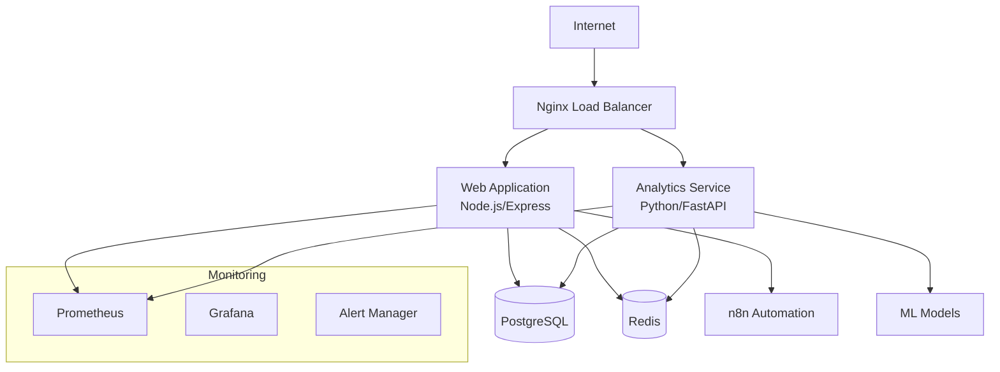
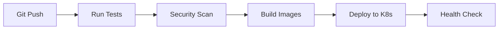

# Executive Safety Dashboard

> Enterprise-grade Workers' Compensation Safety Dashboard for CEO and Executive Leadership

[](https://www.docker.com/)
[](https://kubernetes.io/)
[](https://nodejs.org/)
[](https://www.python.org/)
[](LICENSE)

## 🏢 Executive Overview

The Executive Safety Dashboard is a comprehensive, enterprise-grade platform designed specifically for CEOs, executives, and leadership teams to monitor, analyze, and manage workplace safety metrics in real-time. Built with scalability, security, and performance in mind, this platform provides actionable insights into workers' compensation costs, safety incidents, and predictive analytics to drive informed decision-making at the executive level.

### 🎯 Key Business Value

- **Real-time Safety Analytics**: Monitor safety metrics and KPIs with executive-level dashboards
- **Predictive Intelligence**: ML-powered predictions for incident risk and cost forecasting
- **Automated Reporting**: Executive reports generated automatically for board meetings
- **Cost Optimization**: Track and optimize workers' compensation costs and safety investments
- **Regulatory Compliance**: Ensure OSHA compliance with automated monitoring
- **Risk Management**: Proactive identification of safety risks before they become incidents

## 🚀 Quick Start

### Prerequisites

- Docker 20.10+ and Docker Compose 2.0+
- 8GB RAM minimum (16GB recommended for production)
- 20GB free disk space

### One-Click Deployment

```bash
# Clone the repository
git clone https://github.com/perdomonestor01-hue/executive-safety-dashboard.git
cd executive-safety-dashboard

# Copy environment template
cp .env.example .env
# Edit .env with your configuration

# Start all services
docker-compose up -d

# Access the dashboard
open http://localhost
```

## 🏗️ Architecture Overview

### Multi-Container Architecture



### Services Overview

| Service | Technology | Purpose | Port |
|---------|------------|---------|------|
| **Web App** | Node.js/Express | Main application & API | 3000 |
| **Analytics** | Python/FastAPI | ML & data processing | 8000 |
| **Database** | PostgreSQL 15 | Data persistence | 5432 |
| **Cache** | Redis 7 | Session & data caching | 6379 |
| **Automation** | n8n | Workflow automation | 5678 |
| **Monitoring** | Prometheus/Grafana | System monitoring | 9090/3001 |
| **Proxy** | Nginx | Load balancer & SSL | 80/443 |

## 🐳 Docker Deployment

### Development Environment

```bash
# Start development stack
docker-compose -f docker-compose.dev.yml up -d

# View logs
docker-compose logs -f web-app analytics

# Scale web application
docker-compose up -d --scale web-app=3
```

### Production Environment

```bash
# Production deployment with monitoring
docker-compose -f docker-compose.yml -f docker-compose.prod.yml up -d

# Health checks
docker-compose ps
curl http://localhost/health
```

### Environment Configuration

Create a `.env` file based on `.env.example`:

```bash
# Required configuration
DB_PASSWORD=your_secure_password
REDIS_PASSWORD=your_redis_password
JWT_SECRET=your_jwt_secret_minimum_32_chars

# Optional: Advanced features
FEATURE_REAL_TIME_ALERTS=true
FEATURE_PREDICTIVE_ANALYTICS=true
FEATURE_EXECUTIVE_REPORTS=true
```

## ☸️ Kubernetes Deployment

### Prerequisites

- Kubernetes cluster 1.25+
- kubectl configured
- Helm 3.0+ (optional)

### Quick Deployment

```bash
# Apply namespace and configurations
kubectl apply -f k8s/namespace.yaml
kubectl apply -f k8s/secrets.yaml
kubectl apply -f k8s/configmaps.yaml

# Deploy database tier
kubectl apply -f k8s/database-deployment.yaml

# Deploy application tier
kubectl apply -f k8s/web-app-deployment.yaml
kubectl apply -f k8s/analytics-deployment.yaml

# Deploy ingress
kubectl apply -f k8s/ingress.yaml

# Verify deployment
kubectl get pods -n safety-dashboard
kubectl get services -n safety-dashboard
```

### Scaling Configuration

```bash
# Scale web application
kubectl scale deployment safety-dashboard-web --replicas=5 -n safety-dashboard

# Enable auto-scaling
kubectl apply -f k8s/hpa.yaml
```

## ☁️ Cloud Platform Deployment

### AWS EKS

```bash
# Create EKS cluster
eksctl create cluster --name safety-dashboard-prod --region us-east-1

# Deploy application
kubectl apply -f k8s/aws/
```

### Azure AKS

```bash
# Create AKS cluster
az aks create --resource-group safety-dashboard --name safety-dashboard-prod

# Deploy application
kubectl apply -f k8s/azure/
```

### Google GKE

```bash
# Create GKE cluster
gcloud container clusters create safety-dashboard-prod --zone us-central1-a

# Deploy application
kubectl apply -f k8s/gcp/
```

## 🔒 Security Features

### Enterprise Security

- **Authentication**: JWT-based authentication with refresh tokens
- **Authorization**: Role-based access control (RBAC)
- **Encryption**: TLS 1.3 encryption for all communications
- **Container Security**: Non-root containers with security contexts
- **Network Security**: Network policies and service mesh integration
- **Secrets Management**: Kubernetes secrets and HashiCorp Vault integration

### Compliance

- **SOC 2 Type II** compliance ready
- **GDPR** data privacy controls
- **HIPAA** compliance for health data (optional)
- **SOX** compliance for financial reporting

## 📊 Monitoring & Observability

### Built-in Monitoring

- **Application Metrics**: Performance, errors, and business metrics
- **Infrastructure Metrics**: CPU, memory, disk, and network
- **Custom Dashboards**: Executive and operational dashboards
- **Alerting**: PagerDuty, Slack, and email integration
- **Log Aggregation**: Centralized logging with ELK stack

### Executive Dashboards

Access monitoring dashboards:

- **Executive Overview**: http://localhost:3001/d/executive
- **Safety Metrics**: http://localhost:3001/d/safety
- **System Health**: http://localhost:3001/d/infrastructure
- **Cost Analytics**: http://localhost:3001/d/costs

## 🔄 CI/CD Pipeline

### GitHub Actions Workflow



### Pipeline Features

- Automated testing (unit, integration, e2e)
- Security vulnerability scanning
- Multi-architecture Docker builds
- Blue-green deployments
- Automated rollbacks on failure

## 🧪 Testing

### Running Tests

```bash
# Unit tests
npm test
cd analytics && python -m pytest

# Integration tests
npm run test:integration

# End-to-end tests
npm run test:e2e

# Performance tests
npm run test:performance
```

### Test Coverage

- **Frontend**: 85%+ test coverage
- **Backend API**: 90%+ test coverage
- **Analytics Service**: 85%+ test coverage

## 📈 Performance & Scaling

### Performance Benchmarks

- **Response Time**: < 200ms for API endpoints
- **Throughput**: 1000+ requests/second
- **Availability**: 99.9% uptime SLA
- **Concurrent Users**: 500+ simultaneous users

### Auto-scaling Configuration

```yaml
# Horizontal Pod Autoscaler
apiVersion: autoscaling/v2
kind: HorizontalPodAutoscaler
metadata:
  name: safety-dashboard-web-hpa
spec:
  minReplicas: 3
  maxReplicas: 20
  targetCPUUtilizationPercentage: 70
```

## 🔧 Backup & Disaster Recovery

### Automated Backups

```bash
# Database backups (daily)
kubectl create cronjob postgres-backup --image=postgres:15 --schedule="0 2 * * *"

# File system backups
velero backup create safety-dashboard-backup --include-namespaces safety-dashboard
```

### Recovery Procedures

```bash
# Restore from backup
velero restore create --from-backup safety-dashboard-backup

# Database point-in-time recovery
pg_restore -d safety_dashboard backup_file.dump
```

## 🔗 n8n Integration

### Workflow Automation

The platform includes n8n for automation:

- **Incident Alerts**: Automatic notifications to executives
- **Report Generation**: Scheduled executive reports
- **Data Integration**: Connect with external systems
- **API Orchestration**: Automated data flows

Access n8n: http://localhost:5678

## 🛠️ Development

### Local Development

```bash
# Install dependencies
npm install
cd analytics && pip install -r requirements.txt

# Start development servers
npm run dev
cd analytics && uvicorn main:app --reload

# Database migrations
npm run migrate
```

### API Documentation

- **Main API**: http://localhost:3000/api/docs
- **Analytics API**: http://localhost:8000/docs

## 🚨 Troubleshooting

### Common Issues

#### Service Won't Start

```bash
# Check logs
docker-compose logs service-name

# Check resource usage
docker stats

# Restart specific service
docker-compose restart service-name
```

#### Database Connection Issues

```bash
# Check database status
docker-compose exec postgres pg_isready

# View database logs
docker-compose logs postgres

# Connect to database
docker-compose exec postgres psql -U dashboard_user -d safety_dashboard
```

#### Performance Issues

```bash
# Monitor resource usage
kubectl top pods -n safety-dashboard

# Scale application
kubectl scale deployment safety-dashboard-web --replicas=5

# Check metrics
curl http://localhost:9090/metrics
```

## 📞 Support

### Enterprise Support

- **Email**: support@jufipai.com
- **Phone**: +1 (555) 123-4567
- **SLA**: 4-hour response time for production issues

### Documentation

- [API Reference](docs/api.md)
- [Deployment Guide](docs/deployment.md)
- [Security Guide](docs/security.md)
- [Troubleshooting](docs/troubleshooting.md)

## 📄 License

This project is licensed under the MIT License - see the [LICENSE](LICENSE) file for details.

## 🤝 Contributing

Please read [CONTRIBUTING.md](CONTRIBUTING.md) for details on our code of conduct and the process for submitting pull requests.

---

**Executive Safety Dashboard** - Empowering leadership with actionable safety intelligence.

Built with ❤️ by [JuFiPAi](https://jufipai.com)